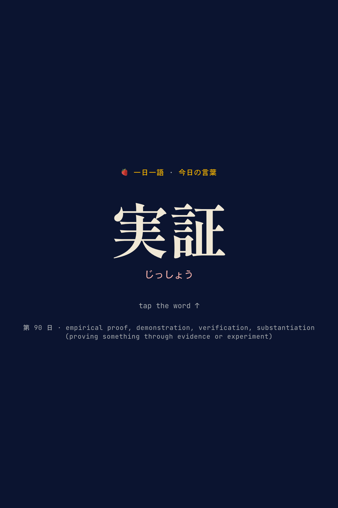
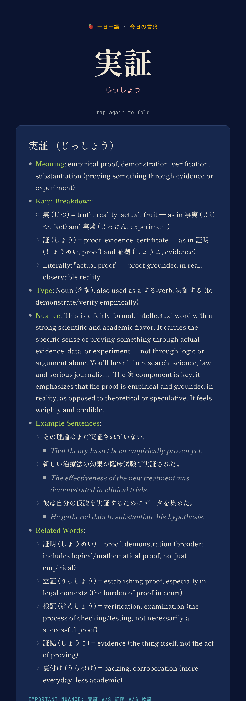

# 🍓 一日一語 (ichinichi-ichigo)

**One Japanese word a day.** A small daily-vocabulary project built from years of
class notes. A home-screen widget shows the word of the day; tap it to open the
website on that word. On the site, tap the word to reveal a full breakdown —
meaning, kanji, nuance, and example sentences — and refresh or double-tap to
explore another word.

🔗 **Live site:** https://vbkmr.github.io/ichinichi-ichigo

## Screenshots

| Home-screen widget                       | Website                     | Tap to reveal                       |
| ---------------------------------------- | --------------------------- | ----------------------------------- |
|  |  |    |

> `assets/site.png` / `assets/site-open.png` are captured from the site.
> `assets/widget.png` must come from a real iPhone home screen — drop your
> screenshot there and commit it (a real home-screen widget can't be captured
> programmatically).

## Word explanations

Each word's breakdown — meaning, kanji components, nuance, formality, example
sentences, and comparison tables — follows the
**[Japanese Word Explainer](https://github.com/vbkmr/waza-ichi/tree/main/plugins/japanese-word-explainer)**
skill (part of the [技市 / waza-ichi](https://github.com/vbkmr/waza-ichi) skill
marketplace), which was used to write and format the explanations shown here.

## Set up the iPhone widget

1. Install **[Scriptable](https://scriptable.app/)**.
2. New script → paste `widget/ichinichi-ichigo.js` → name it `一日一語`.
3. Long-press the home screen → **+** → **Scriptable** → choose a size.
4. Edit the widget: **Script** → `一日一語`; **When Interacting** → **Open URL**.
5. Tap the widget any day to open the site on that day's word.

## Privacy

The repo and site are **public**, so every word and note in `data/goi.json` is
publicly readable. The raw Notion notes are *not* committed — only the cleaned,
enriched dataset is.
